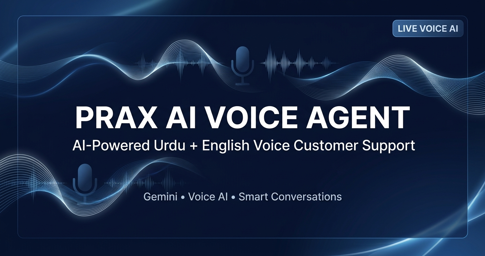

# PRAX AI Voice Agent

Professional AI voice agent platform with real-time voice interaction, AI responses, conversation history, and text fallback.

## Live Demo

**Live Demo:** https://prax-ai-voice-agent.vercel.app

## Features

* AI voice conversations
* Speech recognition
* AI-generated voice responses
* Text fallback
* Agent selection
* Conversation transcript
* Knowledge base
* AI provider configuration
* Human handoff
* Voice branding
* Deployment-ready architecture

## Tech Stack

* React
* Vite
* FastAPI
* Python
* LangGraph
* Gemini
* Supabase
* Vercel
* FastAPI Cloud

## Architecture

* `frontend/` — React/Vite frontend
* `backend/` — FastAPI backend
* `docs/` — Project documentation and preview images
